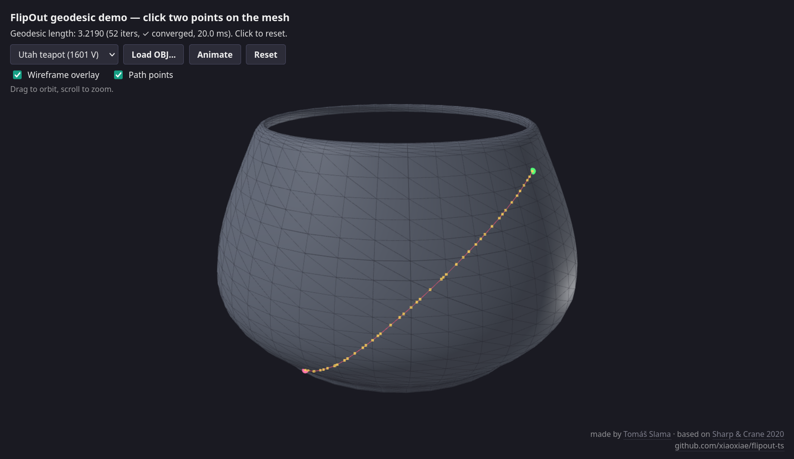

# flipout-ts

TypeScript port of FlipOut, an algorithm for finding geodesic (shortest)
paths on triangle meshes by iterating edge flips. Originally described in
[Sharp & Crane, SIGGRAPH Asia 2020](https://nmwsharp.com/media/papers/flip-geodesics/flip_geodesics.pdf);
ported from the C++ reference in
[geometry-central](https://github.com/nmwsharp/geometry-central) (MIT).
Has an optional Three.js adapter.

There is a [live demo](https://flipout-ts.slama.dev).



## Install

```bash
npm install flipout-ts three
```

`three` is an optional peer dependency — only required if you use the
`flipout-ts/three` adapter. The core (`flipout-ts`) works on plain `Vec3`
tuples and typed arrays and has no runtime dependencies.

## Quick start

```ts
import {
  SurfaceMesh,
  VertexPositionGeometry,
  SignpostIntrinsicTriangulation,
  flipOutPath,
} from 'flipout-ts';
import { meshFromBufferGeometry, pathToBufferGeometry } from 'flipout-ts/three';

// 1. Adapt a THREE.BufferGeometry → SurfaceMesh + Vec3[] positions.
const { mesh, positions } = meshFromBufferGeometry(threeBufferGeom);

// 2. Wrap into a (extrinsic) geometry, then build an intrinsic triangulation.
const geom = new VertexPositionGeometry(mesh, positions);
const intrinsic = new SignpostIntrinsicTriangulation(geom);

// 3. Compute the geodesic between two vertex indices.
const result = flipOutPath(intrinsic, /* srcVertex */ 0, /* dstVertex */ 42);

console.log(result.length);    // total surface length
console.log(result.polyline);  // Vec3[] of points along the geodesic

// 4. (Optional) Lift the polyline back to a THREE.Line.
const lineGeom = pathToBufferGeometry(result.polyline);
```

For source / destination at face-interior or edge-interior points (not just
vertices), use `flipOutPathFromSurfacePoints` from `flipout-ts/flipout`. The
intrinsic triangulation is mutated in-place by the algorithm; rebuild it for
each independent query.

## Bezier curves on a surface

`bezierSubdivide` builds a geodesic Bezier curve through control vertices via
the de-Casteljau-style scheme of Morera, Velho & de Carvalho 2008, using
FlipOut as the straightening oracle. Pair it with `flipEdgeNetworkFromControlPath`
to set up the network from a control-vertex list:

```ts
import {
  SurfaceMesh, VertexPositionGeometry, SignpostIntrinsicTriangulation,
  flipEdgeNetworkFromControlPath,
} from 'flipout-ts';

const sit = new SignpostIntrinsicTriangulation(
  new VertexPositionGeometry(mesh, positions),
);
const net = flipEdgeNetworkFromControlPath(sit, [c0, c1, c2, c3], {
  markInterior: true,
});
net!.bezierSubdivide(3);             // 3 rounds of subdivision
console.log(net!.pathLength());      // intrinsic length of the Bezier curve
console.log(net!.pathHalfedges());   // intrinsic halfedge sequence
```

**Cross-runtime caveat:** the underlying priority queue is sensitive to
1-ulp differences between V8's `Math.acos` and glibc's `std::acos`. On
near-degenerate geometries (the canonical Newell teapot is one) the same
input may produce a path whose length differs from geometry-central's
reference by up to ~1%. The output is still a valid geodesic Bezier curve.
This is a fundamental V8/glibc divergence; see `CLAUDE.md` for the full
investigation.

## Port conventions

- **One source file per geometry-central translation unit.** A header banner
  names the source file and SHA of geometry-central it was ported from.
- **Naming preserved where possible** (`SurfaceMesh`, `VertexPositionGeometry`,
  `flipEdge`). TS conventions used for casing (camelCase methods, PascalCase
  classes).
- **No Three.js inside `src/{math,mesh,geometry,intrinsic,flipout}`.** Three.js
  types appear only in `src/three/`. The core works on plain typed arrays /
  `Vec3` tuples.
- **Numerical type:** `number` (Float64) throughout, matching geometry-central's
  `double`.

## License

MIT — see `LICENSE` and `NOTICE` for the geometry-central attribution.
